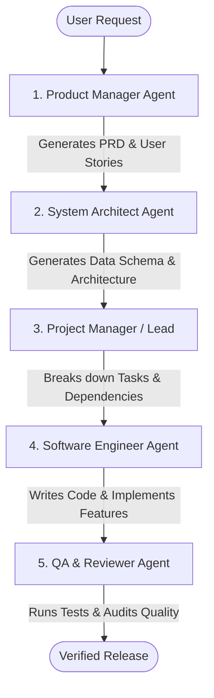

# 🤖 MULTI-AGENT ORCHESTRATION & ROLE BLUEPRINTS

> Sumber Inspirasi: `FoundationAgents/MetaGPT`, `bytedance/deer-flow`, `ashishpatel26/500-AI-Agents-Projects`

## 1. Role-Based Agent Separation (The Software Company Pattern)

Dalam sistem multi-agent profesional, satu LLM tidak mengerjakan semua hal sendirian, melainkan dibagi menjadi peran-peran spesifik:

1. **Product Manager (PM)**:
   - Input: Ide kasar / brief user.
   - Output: PRD (*Product Requirements Document*), User Stories, Minimal Scope.
2. **System Architect**:
   - Input: PRD.
   - Output: System Architecture Diagram, API Contracts, Database Schema, Tech Stack Choice.
3. **Software Engineer**:
   - Input: Task item + Architecture.
   - Output: Clean code, Modular components, TDD test cases.
4. **QA & Security Reviewer**:
   - Input: Code diff.
   - Output: Lint check, test coverage audit, security vulnerability scan.

## 2. Memory & State Sharing
- **Persistent State**: Simpan konteks global di file `.json` atau database SQLite lokal (bukan di context window LLM yang cepat penuh).
- **Handoff Packets**: Ketika berganti agent, kirimkan hanya ringkasan *Diff* dan artefak yang relevan (*token-budgeting*).
